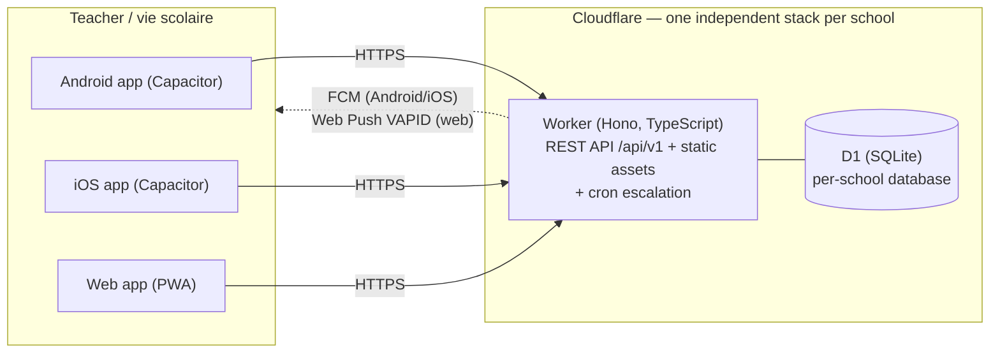

# École Directe Exclusions

[](https://github.com/sctg-development/ecole-directe-exclusions/actions/workflows/ci.yml)
[](./LICENSE)
[](./package.json)


Real-time classroom **exclusion tracking** for schools. When a teacher excludes a disruptive
student from a lesson, the student today walks the school unsupervised — nobody at the student-life
office (_vie scolaire_) knows an exclusion happened. This app closes that gap: the teacher reports
the exclusion from their tablet in **under 10 seconds**, the vie scolaire receives a **push
notification immediately**, acknowledges it, marks the student as arrived — or escalates a search
if the student never shows up. Every state change is kept in an immutable audit trail.

## In brief

A student excluded from class must never wander unsupervised around the school. With this application, the teacher reports the exclusion in under 10 seconds from their tablet; the student life office (_vie scolaire_) is notified immediately, takes charge of the student upon arrival, and an automatic alert is triggered if the student does not appear within the configured timeframe (10 minutes by default). Each school has a completely independent deployment (GDPR-compliant), and the full history of incidents is retained for educational follow-up.

## How it works



- **One fully independent deployment per school** (separate Worker, D1 database and secrets) — no
  student data ever crosses school boundaries, a GDPR requirement.
- **Free-tier friendly**: fewer than 10 exclusions/day/school fits the Cloudflare free plans with
  orders of magnitude of headroom.
- The exclusion lifecycle (`pending → acknowledged → arrived/missing → resolved`, plus
  `cancelled`) is a state machine defined once in `@exclusions/shared` and enforced everywhere.

## Monorepo layout

| Path              | Package              | Purpose                                                                            |
| ----------------- | -------------------- | ---------------------------------------------------------------------------------- |
| `packages/shared` | `@exclusions/shared` | Domain types, Zod API schemas, exclusion lifecycle state machine, shared constants |
| `apps/server`     | `@exclusions/server` | Cloudflare Worker: REST API, auth, D1, push dispatch, SIS adapters, cron           |
| `apps/client`     | `@exclusions/client` | React PWA + Capacitor shells (Android/iOS)                                         |
| `docs/`           | —                    | Architecture, API contract, data model, deployment, GDPR, mobile builds            |
| `scripts/`        | —                    | Operational helpers (VAPID key generation)                                         |
| `.github/`        | —                    | CI and per-school deployment workflows                                             |
| `.claude/`        | —                    | Claude Code skills for contributors                                                |

## Quick start

Prerequisites: Node.js >= 22 and npm.

```bash
git clone https://github.com/sctg-development/ecole-directe-exclusions.git
cd ecole-directe-exclusions
npm install

# Create the local D1 database (SQLite via wrangler)
npm run db:migrate:local -w @exclusions/server
```

Local secrets: create `apps/server/.dev.vars` (gitignored) with at least `JWT_SECRET` and
`BOOTSTRAP_SECRET` (any random strings for development). Web-push testing also needs the VAPID
keys — generate them with `node scripts/generate-vapid-keys.mjs`.

Run the two dev servers in two terminals:

```bash
npm run dev -w @exclusions/server   # API on http://localhost:8787
npm run dev -w @exclusions/client   # Web app on http://localhost:5173
```

Bootstrap the first admin account (one-time, guarded by the bootstrap secret):

```bash
curl -X POST http://localhost:8787/api/v1/auth/bootstrap \
  -H "Content-Type: application/json" \
  -H "X-Bootstrap-Secret: <your BOOTSTRAP_SECRET>" \
  -d '{"email":"admin@example.org","displayName":"Admin","password":"a-strong-password-protecting-super-admin"}'
```

Then log in on http://localhost:5173 and create teacher / vie-scolaire accounts from the admin
screen. Useful checks while developing:

```bash
npm run lint          # ESLint over the whole repo
npm run format:check  # Prettier check
npm run typecheck     # tsc --noEmit in every workspace
npm test              # Vitest in every workspace (server tests run inside workerd)
npm run build -w @exclusions/client   # production build of the web app
npm run build -w @exclusions/server   # wrangler dry-run build (needs the client build first)
```

## Documentation

- [Architecture](./docs/ARCHITECTURE.md) — system overview, lifecycle, roles, auth, push
- [API contract](./docs/API.md) — REST endpoints (`/api/v1`)
- [Data model](./docs/DATA-MODEL.md) — D1 schema and retention
- [Deployment](./docs/DEPLOYMENT.md) — per-school runbook (Cloudflare, secrets, bootstrap)
- [GDPR](./docs/GDPR.md) — lawful basis, minimization, retention, data subject rights
- [Mobile builds](./docs/MOBILE.md) — Capacitor Android/iOS, FCM/APNs, store distribution
- [Contributing](./CONTRIBUTING.md) · [Security policy](./SECURITY.md) ·
  [Code of conduct](./CODE_OF_CONDUCT.md)

## Tech stack

- **TypeScript** (strict) everywhere — one language for server, clients and shared domain logic
- **Hono** on **Cloudflare Workers**, **D1** (SQLite) per school, cron triggers for escalation
- **React 19 + Vite + Tailwind CSS 4** web client, wrapped by **Capacitor 8** for Android/iOS
- **Web Push (VAPID)** and **FCM HTTP v1** push, both implemented with WebCrypto (no Node deps)
- **Zod** schemas shared between server validation and client types
- **Vitest** everywhere; server tests run inside workerd via `@cloudflare/vitest-pool-workers`

UI language is **French** (users are French school staff); code, comments and docs are English.

## License

[MIT](./LICENSE) © 2026 Ronan Le Meillat — SCTG Development
