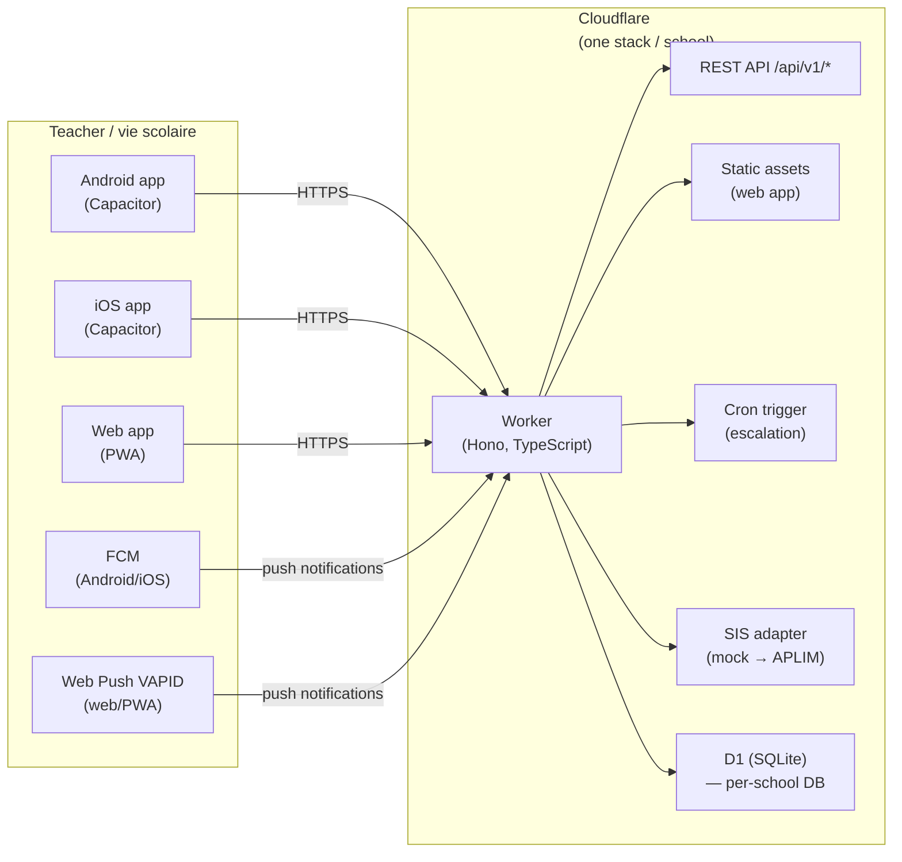
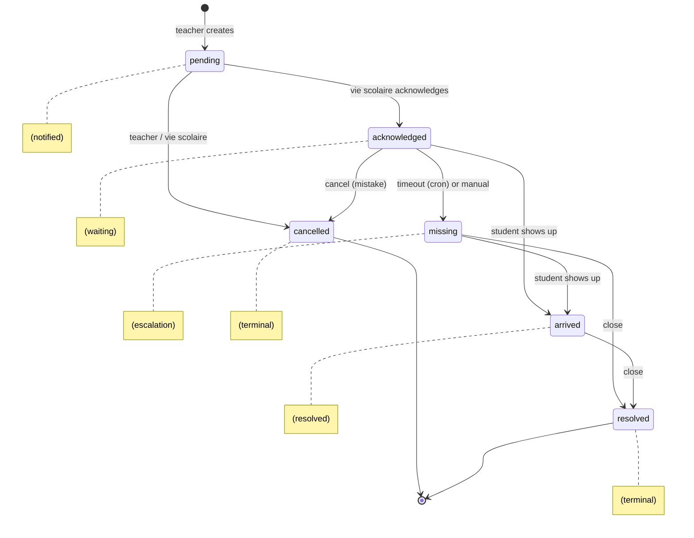

# Architecture

Real-time classroom **exclusion tracking** for schools. When a teacher excludes a student from
class, the student-life office (_vie scolaire_) is notified within seconds so the student is
expected, tracked, and searched for if they never show up.

## Problem statement

Teachers can exclude a disruptive student from a lesson. Today the student walks the school
unsupervised: nobody at the vie scolaire knows an exclusion happened. This application closes that
gap: the teacher reports the exclusion from their tablet in **under 10 seconds**, the vie scolaire
receives a **push notification immediately**, acknowledges it, and marks the student as arrived —
or escalates a search if the student never shows up.

## System overview



- **One fully independent deployment per school** (separate Worker, separate D1 database,
  separate secrets). No student data ever crosses school boundaries — a GDPR requirement.
  Schools are wrangler _environments_ of the same codebase.
- **Free-tier friendly**: fewer than 10 exclusions/day/school. Workers free plan (100k req/day),
  D1 free plan, and cron triggers cover this with orders of magnitude of headroom.
- The web client is served by the same Worker via [Workers static assets], so one deployment
  serves both the API and the PWA.

## Monorepo layout

| Path              | Package              | Purpose                                                                            |
| ----------------- | -------------------- | ---------------------------------------------------------------------------------- |
| `packages/shared` | `@exclusions/shared` | Domain types, Zod API schemas, exclusion lifecycle state machine, shared constants |
| `apps/server`     | `@exclusions/server` | Cloudflare Worker: REST API, auth, D1, push dispatch, SIS adapters, cron           |
| `apps/client`     | `@exclusions/client` | React PWA + Capacitor shells (Android/iOS)                                         |
| `docs/`           | —                    | Architecture, API contract, data model, deployment, GDPR                           |
| `.github/`        | —                    | CI/CD workflows                                                                    |
| `.claude/`        | —                    | Claude Code skills for contributors                                                |

`@exclusions/shared` ships TypeScript sources directly (no build step); Vite, wrangler/esbuild and
Vitest all consume `.ts` workspace dependencies natively.

## Exclusion lifecycle

The single source of truth is `packages/shared/src/lifecycle.ts`. States:



- `pending` — created by the teacher; all vie-scolaire staff are pushed a notification.
- `acknowledged` — a vie-scolaire member confirmed they are expecting the student.
- `arrived` — the student reported to the vie scolaire (allowed from `pending`, `acknowledged`
  or `missing`).
- `missing` — the student did not show up within `ESCALATION_MINUTES` (default **10**, set per
  school). Set automatically by the cron trigger or manually. Triggers an **escalation push**.
- `resolved` — incident closed by the vie scolaire (from `arrived` or `missing`), with optional
  comment.
- `cancelled` — false alarm; only from `pending`/`acknowledged`, by the creating teacher or the
  vie scolaire.

Every state change is appended to the immutable `exclusion_events` audit table.

## Roles

| Role           | Can do                                                                               |
| -------------- | ------------------------------------------------------------------------------------ |
| `teacher`      | Create exclusions, cancel their own, view their own history                          |
| `vie-scolaire` | Everything on exclusions (acknowledge/arrived/missing/resolve/cancel), view all data |
| `admin`        | Everything, plus user management and school settings                                 |

## Authentication

- Per-school accounts provisioned by the school `admin`. Email + password.
- Passwords hashed with **PBKDF2-SHA256, 210 000 iterations** (WebCrypto — native to Workers).
- **Access token**: JWT (HS256, `hono/jwt`), 15-minute lifetime, carries `sub`, `role`, `name`.
- **Refresh token**: opaque 256-bit random value, stored **hashed** (SHA-256) in D1,
  14-day lifetime, rotated on every refresh, revocable.
- Login rate limiting: max 10 attempts / 5 minutes per e-mail (D1-backed).
- All secrets (`JWT_SECRET`, VAPID keys, FCM service account) are wrangler secrets — never in git.

## Push notifications

| Platform  | Transport                              | Sender implementation                            |
| --------- | -------------------------------------- | ------------------------------------------------ |
| Web / PWA | Web Push (VAPID, RFC 8291 `aes128gcm`) | WebCrypto in the Worker — no Node dependencies   |
| Android   | FCM HTTP v1                            | Service-account JWT (RS256) signed via WebCrypto |
| iOS       | FCM HTTP v1 (Firebase relays to APNs)  | Same FCM sender                                  |

Notified events: new exclusion → all vie-scolaire devices; escalation (`missing`) → all
vie-scolaire devices (re-alert); arrival/resolution → the creating teacher. Push delivery is
best-effort: the dashboard also polls, so a lost push never loses data.

## SIS adapters (classes & students)

APLIM Charlemagne / École Directe does not expose an API yet. The server defines a provider
interface and ships a deterministic mock:

```ts
interface SisProvider {
  listClasses(): Promise<SchoolClass[]>;
  listStudents(classId: string): Promise<Student[]>;
  getStudent(studentId: string): Promise<Student | null>;
}
```

- `MockSisProvider` — deterministic, seeded by `SCHOOL_ID`; generates realistic French class
  names (Seconde/Première/Terminale…) and student rosters matching each school's real size.
- `AplimSisProvider` — placeholder for the future APLIM API integration (or any other SIS).
- Selected by the `SIS_PROVIDER` environment variable (`mock` | `aplim`).

Exclusions **denormalize** the student and class display names at creation time, so historical
records stay intact even if the SIS data changes (and the SIS holds the minimum data needed).

## Per-school configuration

Wrangler environments (in `apps/server/wrangler.jsonc`), one per school:

| Env                 | School                            | Classes | Students | Teacher tablets |
| ------------------- | --------------------------------- | ------- | -------- | --------------- |
| `apprentis-auteuil` | Fondation des Apprentis d'Auteuil | 32      | 937      | Android         |
| `saint-dominique`   | Lycée Saint Dominique             | 42      | 1228     | iOS             |
| `saint-paul`        | Lycée Saint Paul                  | 52      | 1543     | iOS             |

Each environment has its own D1 database binding, its own secrets, and school-specific vars
(`SCHOOL_ID`, `SCHOOL_NAME`, `ESCALATION_MINUTES`, `SIS_PROVIDER`).

## Key technology choices

- **TypeScript everywhere** — one language across server, clients and shared domain logic.
- **Hono** on Workers — tiny, fast, first-class Workers support.
- **D1** — relational audit trail and reporting queries on the free tier.
- **React 19 + Vite + Tailwind CSS 4** for the web client; **Capacitor 8** wraps the same build
  into the Android and iOS apps with native push plugins.
- **Vitest** everywhere; `@cloudflare/vitest-pool-workers` runs server tests inside workerd.
- UI language is **French** (users are French school staff); code and docs are **English**
  (open-source community). UI strings live in a single i18n module for future locales.

## Related documents

- [API contract](./API.md)
- [Data model](./DATA-MODEL.md)
- [Deployment guide](./DEPLOYMENT.md)
- [GDPR notes](./GDPR.md)
- [Mobile builds](./MOBILE.md)

[Workers static assets]: https://developers.cloudflare.com/workers/static-assets/
